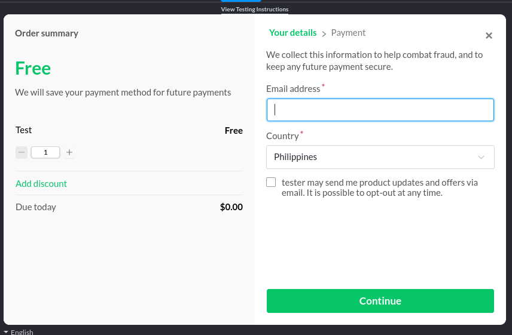
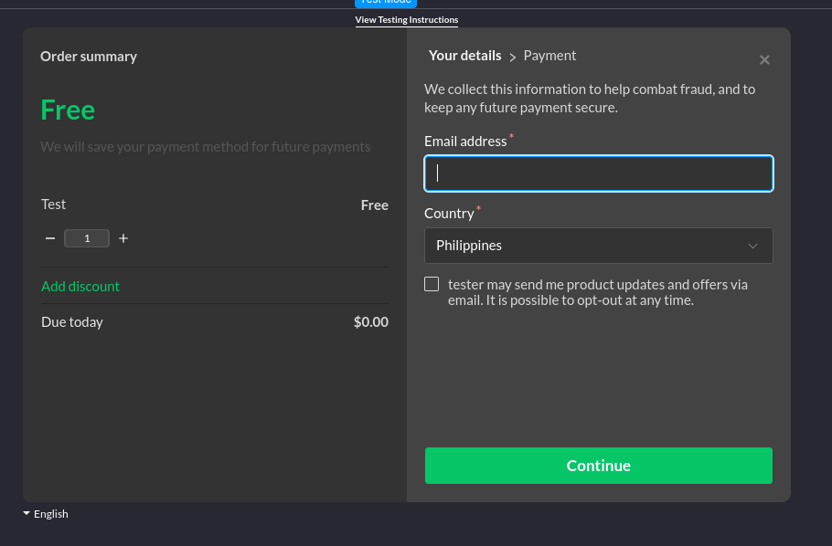

# 3. Implementing Overlay Checkout

Date: 2025-02-19

## Contents

- [Summary](#summary)
  - [Issue](#issue)
  - [Decision](#decision)
  - [Status](#status)
  - [Consequences](#consequences)
- [Decision Drivers](#decision-drivers)
- [Considered Options](#considered-options)
- [Decision Outcome](#decision-outcome)
  - [Positive Consequences](#positive-consequences)
  - [Negative Consequences](#negative-consequences)
- [Pros and Cons of the Options](#pros-and-cons-of-the-options)
- [Notes](#notes)
- [Others](#others)
  - [ADR Template References](#adr-template-references)

ADR Owner: Isiah Jordan Dimaunahan

Stakeholders:
- AI core team

## Summary

### Issue

Customers who have chosen a subscription plan for Rakai AI will need to provide their details. For this request, a checkout UI is required and should be integrated to accept user input. The Paddle API offers a checkout feature that enables quick implementation through an overlay method, for which we have proposed the implementation steps.

### Decision

The final decision is to implement the overlay checkout using `JavaScript`, by first setting the default payment link via the Paddle.com website. After that, the `https://cdn.paddle.com/paddle/v2/paddle.js` URL is included using the `<script>` tag. We initialize Paddle by generating a client-side token in the Paddle dashboard and calling the `Paddle.Checkout.open()` method within JavaScript. This method accepts several arguments, which can be toggled or set, such as `successUrl`, `theme`, `settings`, and many more. An important setting required is `displayMode`. To properly implement the overlay checkout, the `'displayMode: 'overlay''` option must be included in the execution.

Another crucial argument is the item list. From the dashboard, products need to be generated with their respective prices and subscription plans. A token is generated per subscription plan price, which is then passed as the `items` argument with a quantity of 1. This would be executed through a click event on the pricing page.

### Status

Proposed

### Consequences

A key benefit of using the overlay checkout is quick integration. However, this comes at the cost of reduced flexibility.

## Decision Drivers

- **Simple to Implement:** The process requires only the Paddle dashboard and the API module URL. During integration, initializing and executing the `Paddle.Checkout.open` method are the minimum required steps to run an overlay within the website. In the dashboard, a product with a price and subscription must be created, along with the client token and the default permanent link set to the website.
- **Most Flexible Option:** Using JavaScript for the Paddle API provides access to all features offered by Paddle, including checkouts, events, notifications, and customized workflows.
- **Dynamic Features:** Since events are supported, a callback mechanism can distinguish different states of the billing process. This introduces a customizable pipeline for payments and subscription plan access.
- **Organized Workflow:** Compared to other options, consolidating the logic of the Paddle process in a single location within the codebase is more efficient. This contrasts with using `HTML` data attributes in other programming languages, which may not fully support the Paddle API.

## Considered Options

**Implementing using JavaScript:** Using `JavaScript` to instantiate the Paddle API on a website and call the overlay checkout. This is the approach commonly recommended in the Paddle documentation, and the entire process can be integrated into a single JavaScript module with dynamic features.

**Implementing using HTML:** While `JavaScript` can be used, the Paddle API also supports data attributes. A `<a href="#">` tag can be used as a button to trigger the overlay checkout.

**Prefill Customer Information using Account Details:** The API allows automating the customer information entry process using account details. This eliminates repetitive form-filling and removes the need for an overlay UI. However, it may require a customized page for confirmation or additional payment method entries. This option is the most convenient for customers.

## Decision Outcome

We chose to integrate the API using `JavaScript`, as it allows for fast implementation while offering the most flexibility. Unlike `HTML` data attributes, it enables `eventCallback` to monitor workflow states. Additionally, JavaScript provides a dynamic process with minimal effort.

## Pros and Cons of the Options

| Option | Pros | Cons |
| --- | --- | --- |
| **Implementing using JavaScript** | - More flexible and dynamic than the `HTML` approach, providing developers with extensive tools.   - Organizes logical components, APIs, and backend features appropriately within a programming language instead of a markup language.   - The Paddle JS API offers many features unavailable in `HTML`, such as event handling. | - If the checkout process is the only required feature, JavaScript introduces unnecessary complexity. |
| **Implementing using HTML** | - The simplest option among the three.   - Allows easy integration with backend programming languages that do not support JavaScript-based API calls. | - Introduces redundancy, as `JavaScript` is generally more suitable for modern web development.   - Restricts the usage of Paddle API features that are only accessible via JavaScript.   - Could clutter the `HTML` codebase, leading to inconsistencies. |
| **Prefill Customer Information using Account Details** | - Provides a more convenient and time-efficient process for customers.   - Minimizes the subscription plan cycle, improving accessibility. | - Requires an additional user interface for transaction confirmation and updates.   - Needs additional semantics to ensure that parameters correctly reflect user details. |

## Notes

- Many additional features can be set for the overlay checkout. One of them is the `variant` argument, which determines whether the overlay appears within the same page or a separate page. This can be considered based on frontend team preferences. This feature, along with others, was left out since the priority of this research is to implement an overlay checkout.
- While the prefill option is listed separately, it can still be used alongside the overlay in JS/HTML. The separation is intentional, as this research focuses on implementing an overlay. The third option—excluding the overlay or replacing it with a custom modal—only applies if no UI element is needed, not because the prefill feature is unavailable.

## Others

- A screenshot for the GUI overlay in `Paddle.Checkout.open()`.

- The dark theme color for the overlay design.

### ADR Template References
- By [Michael Nygard](https://github.com/joelparkerhenderson/architecture-decision-record/tree/main/locales/en/templates/decision-record-template-of-the-madr-project)
- By [Jeff Tyree and Art Akerman](https://github.com/joelparkerhenderson/architecture-decision-record/tree/main/locales/en/templates/decision-record-template-by-jeff-tyree-and-art-akerman)
- By the [Markdown Any Decision Records (MADR) project](https://github.com/joelparkerhenderson/architecture-decision-record/tree/main/locales/en/templates/decision-record-template-of-the-madr-project)
