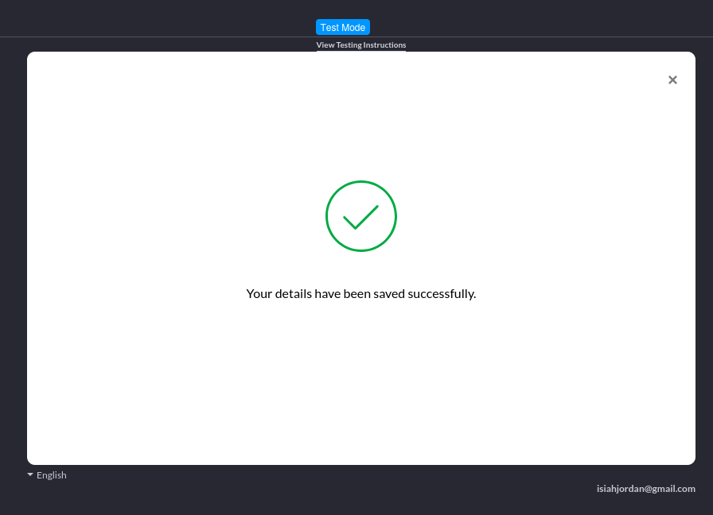
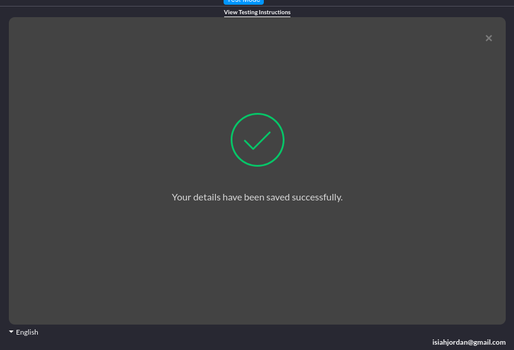

# 4. Handled success page with customization

Date: 2025-02-18 

## Contents

- [Summary](#summary)
  - [Issue](#issue)
  - [Decision](#decision)
  - [Status](#status)
  - [Consequences](#consequences)
- [Decision Drivers](#decision-drivers)
- [Considered Options](#considered-options)
- [Decision Outcome](#decision-outcome)
- [Pros and Cons of the Options](#pros-and-cons-of-the-options)
- [Notes](#notes)
- [Others](#others)
  - [ADR Template References](#adr-template-references)

ADR Owner: Isiah Jordan Dimaunahan

Stakeholders:

## Summary

- AI core team

### Issue

After a successful checkout transaction within Rikai AI, clients should receive a clear confirmation of their purchase. To enhance simplicity, convenience, and visual appeal, we propose a customized success page that provides a seamless and engaging post-checkout experience.

### Decision

Decision was made to apply the default paddle success page for minimal effort but convinient to the developer and user. It doesn't require additional steps besides the overlay setting for `Paddle.Checkout.open()`.

### Status

Proposed

### Consequences

The decision to use the simple paddle success page results into no additional code integration besides the standard invoke for the `Paddle.Checkout.open()` overlay settings. In exchange, control over the design for the success page is compromised and may not fit the theme for the website.

## Decision Drivers

- **Simplistic Integration:** The success page is a small portion of the design aspect for the entire frontend design. Because of its small presence to the user, the offer for a simple design tradeoffs would not affect the user experience in the slightest. 
- **Less Redundancy:** Paddles default page provides the common requirements often found on many different success style pages. Offering a modern UI simplistic design and thus removes the need for time consuming planning and development.
- **Pragmatic Choice:** Integration seeks a quick implementation of the checkout with the least inconvinience. Because of the modern design for both light themes and dark themes (using the `theme: <light/dark>` option), can be enough given the specific goal of alerting the user.
- **Conviniency Between Parties:** User does not require over-engineer designs given that the success page is not the focal point of the checkout page. It is just a handle for confirmation given to users thus, lessening the time needed for the developers and operations alike in implementation. 

## Considered Options

- **Default paddle success page:** Notifies the customer of their transaction via page and email of their order details.
- **Customized success page:** Redirects the customer after successful transaction to whatever data-success-url is set in HTML or the `Paddle.Checkout.open()` attribute called `successUrl` has been setted. It can also be configured during initialization step through process of `eventCallback`.
- **Email confirmation:** Using email as source of confirmation while having the option of using `Webhooks` for additional control during email phase. This process skips the success page entirely through routing back to main page or closure of the checkout.

## Decision Outcome

We chose to rely on the Paddles default success page for a quick integration with procriatory messages 

## Pros and Cons of the Options

| **Option** | **Pros** | **Cons** |  
|------------|---------|---------|  
| **Default paddle success page** | - The easiest option to implement, requiring no additional content or configuration.   - Efficient in terms of performance and ease of use for end users.   - Suitable for providing a quick confirmation result.   | - Limited flexibility due to restricted control over the page.   |  
| **Customized success page** | - Easily accessible to developers, reducing ambiguity.   - Allows greater control over the confirmation details provided to the customer.   - Acts as a middle ground between a simple notification and a fully customized workflow via `Webhooks`.   - While not the easiest option, it is still relatively simple to integrate by adding a `successUrl` argument.   | - Adds an extra step to the development process.   - May not always be fully utilized due to its relatively simple nature.   |  
| **Email confirmation** | - Simple to implement, similar to the default success page.   - The most efficient option in terms of performance.   | - Requires an alert for the user, to notify checkout success which often can be hassle to the user who will require to open the email just to be notified for the state of transaction.   - Introduces redundancy for non-sensitive data.   - To make sure the user knows the transaction went in, it requires a simple additional alert from the website to reassure details have been sent to the email. This will require additional design. |

## Notes

- Each option provided is interconnected and often built in conjunction with others. For example, email confirmation is automatically handled by the Paddle checkout but can be added separately in cases where exclusion from the web page is chosen. In such cases, additional steps would be required to include confirmation with the email billing details.

## Others
- A screenshot of the success page made provided by the Paddle API.

- A color scheme change after configuring `theme: 'black'`, an option for `Paddle.Checkout.open`.

### ADR Template References
- By [Michael Nygard](https://github.com/joelparkerhenderson/architecture-decision-record/tree/main/locales/en/templates/decision-record-template-of-the-madr-project)
- By [Jeff Tyree and Art Akerman](https://github.com/joelparkerhenderson/architecture-decision-record/tree/main/locales/en/templates/decision-record-template-by-jeff-tyree-and-art-akerman)
- By the [Markdown Any Decision Records (MADR) project](https://github.com/joelparkerhenderson/architecture-decision-record/tree/main/locales/en/templates/decision-record-template-of-the-madr-project)

