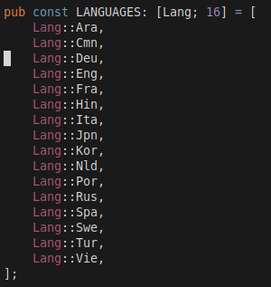
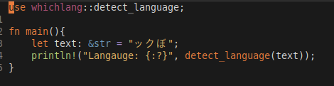
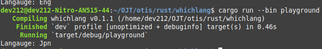
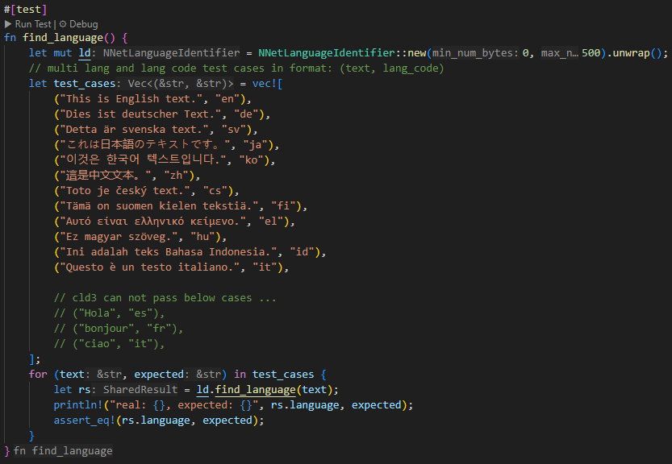
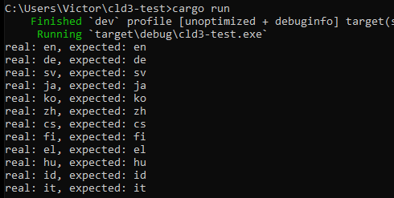
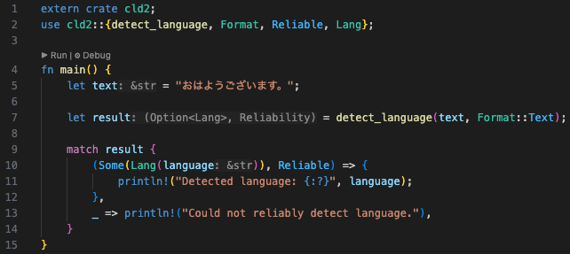
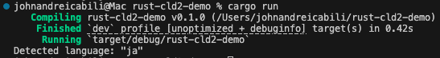

# 0. Switch to hybrid architecture

Date: 2025-03-06

## Contents

- [Summary](#summary)
  - [Issue](#issue)
  - [Decision](#decision)
  - [Status](#status)
  - [Consequences](#consequences)
- [Decision Drivers](#decision-drivers)
- [Considered Options](#considered-options)
- [Decision Outcome](#decision-outcome)
  - [Positive Consequences](#positive-consequences)
  - [Negative Consequences](#negative-consequences)
- [Pros and Cons of the Options](#pros-and-cons-of-the-options)
- [Notes](#notes)
- [Others](#others)
  - [ADR Template References](#adr-template-references)

ADR Owner:
- Isiah Jordan Dimaunahan
- Victor Caro
- John Andrei Cabili

Stakeholders:
- AI core team

## Summary

### Issue

In the midst of communication, it is often the case that a variety of languages spoken within a community can create a language barrier, which AI may assist in overcoming. In a translation pipeline, identifying the language can help steer the process toward the correct translation medium.

In the Rust ecosystem, there are several candidates that can effectively fit the bill. A specific requirement is the support for whitelisting and compatibility with 26 different languages specified in the following list:

**The 26 Different Language Prerequisites**
- Assamese (as)
- Cebuano (ceb)
- Corsican (co)
- Dhivehi (dv)
- Frisian (fy)
- Scots Gaelic (gd)
- Galician (gl)
- Hausa (ha)
- Hawaiian (haw)
- Hmong (hmn)
- Haitian Creole (ht)
- Igbo (ig)
- Krio (kri)
- Kurdish (ku)
- Kyrgyz (ky)
- Luxembourgish (lb)
- Lao (lo)
- Malagasy (mg)
- Meiteilon (Manipuri) (mni-Mtei)
- Maltese (mt)
- Nyanja (Chichewa) (ny)
- Pashto (ps)
- Sindhi (sd)
- Samoan (sm)
- Sundanese (su)
- Tajik (tg)

### Decision

### Status

Proposed

### Consequences

## Decision Drivers

## Considered Options

- **whichlang:** An alternative to whatlang, its approach applies a `Multiclass Logistic Regression` with a (2, 3, 4) n-gram preprocessing step for a given string input. The crate supports 16 different languages: `Arabic`, `Mandarin`, `German`, `English`, `French`, `Hindi`, `Italian`, `Japanese`, `Korean`, `Dutch`, `Portuguese`, `Russian`, `Spanish`, `Swedish`, `Turkish`, `Vietnamese`. To detect a specific string of text to a corresponding language, we can invoke the function `whichlang::detect_language` which takes a `&str` as an argument. In the `weights.rs`, language selection and wieghts of the model inlcuding the intercept is listed out within. In comparison to whatlang, benchmark result shows high accurate results over the restricted 16 languages against whatlang. It was also notable that the model pipeline is a lot more faster than the opposition thanks to the smaller model architecture.

- **cld3-rs:** A Rust binding for Google's Compact Language Detector 3 (CLD3). It is a neural network-based approach that supports detecting 107 languages. CLD3 is particularly optimized for short text language detection. The model is relatively lightweight and efficient. The crate provides an easy-to-use API for language detection. However, the model does not have language whitelisting capabilities.

- **rust-cld2**: A probabilistic language detection library that can detect over 83 languages. It utilizes a Naïve Bayesian classifier, scoring n-grams of text to determine the most probable language. It is optimized for larger text bodies, typically web pages of at least 200 characters, and can return the top three languages found in mixed-language texts. CLD2 works by analyzing sequences of characters and word patterns, ensuring a high degree of accuracy for most languages. It is especially suited for identifying languages on web pages, filtering out irrelevant data such as punctuation, digits, and HTML tags. However, CLD2 does not offer built-in support for language whitelisting, which may be a limitation when targeting specific languages, as it may return languages outside the predefined whitelist.

## Pros and Cons of the Options

| Option | Pros | Cons |
| --- | --- | --- |

## Notes

## Others

- Whichlang supported languages and a simple execution of the whichlang detection.  
  - *Language List* 
  - *Sample Code* 
  - *Code Output* 
    
- cld3-rs supported languages and a simple execution of the cld3-rs detection.  
  - [*Language List*](https://github.com/ttys3/cld3-rs?tab=readme-ov-file#supported-languages)
  - *Sample Code* 
  - *Code Output* 
    
- rust-cld2 supported languages and a simple execution of the rust-cld2 detection.  
  - [*Language List*](https://github.com/CLD2Owners/cld2?tab=readme-ov-file#supported-languages)
  - *Sample Code* 
  - *Code Output* 
    
### ADR Template References
- By [Michael Nygard](https://github.com/joelparkerhenderson/architecture-decision-record/tree/main/locales/en/templates/decision-record-template-of-the-madr-project)
- By [Jeff Tyree and Art Akerman](https://github.com/joelparkerhenderson/architecture-decision-record/tree/main/locales/en/templates/decision-record-template-by-jeff-tyree-and-art-akerman)
- By the [Markdown Any Decision Records (MADR) project](https://github.com/joelparkerhenderson/architecture-decision-record/tree/main/locales/en/templates/decision-record-template-of-the-madr-project)
